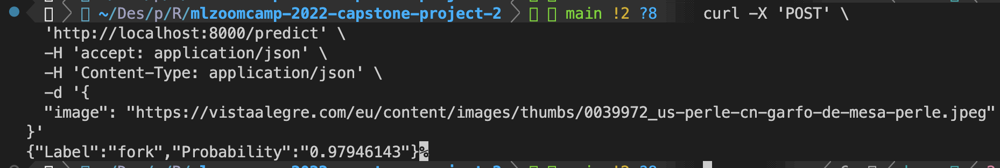
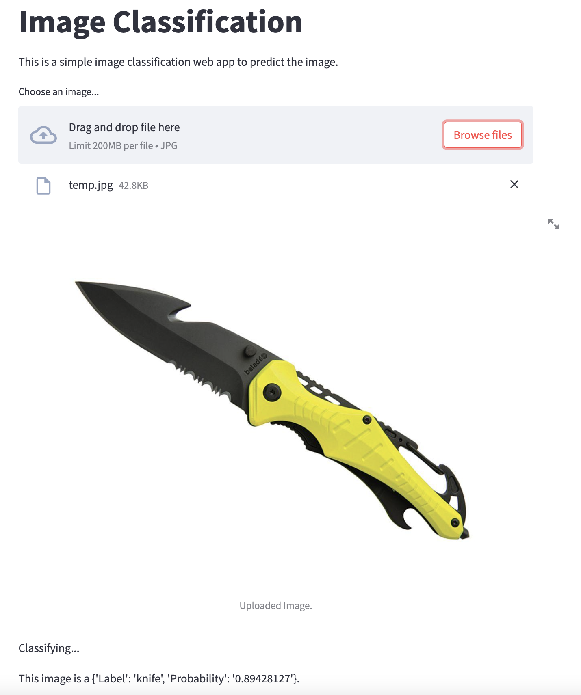

# mlzoomcamp-2022-capstone-project-2

This is the repository for the second capstone project of the Machine Learning Zoomcamp course 2022.

## Project description
In this project, I have worked on a Kaggle image classification contest organized by [DataTalks.Club](https://www.kaggle.com/competitions/kitchenware-classification/overview).

The goal of the competition is to classify images of kitchenware into 6 classes. The dataset contains 9367 images of kitchenware, each belonging to one of 6 classes. The classes are:

* cups
* glasses
* plates
* spoons
* forks
* knives

The dataset is split into a training set and a test set. The training set contains 5559 images, while the test set contains 3808 images.

## Project structure
The project is structured as follows along with files and folders:

* `kitchenware-classification/images/` - contains the images named as <id>.jpg (NOTE: Make sure to download the [data](https://www.kaggle.com/competitions/kitchenware-classification/data?select=images) from Kaggle and put images folder here.)
* `kitchenware-classification/data/` - contains the train.csv and test.csv files.
* `kitchenware-classification/models/` - contains the trained models.
* `kitchenware-classification/notebooks.ipynb` - Jupyter notebook which have the EDA along with the model training code and the submission code.
* `kitchenware-classification/kaggel-submission.csv` - submission file
* `Pipfile` - pipenv file
* `Pipfile.lock` - pipenv file
* `Dockerfile` - docker file for the API and streamlit app
* `main.py` - API file which will run the model and return the prediction for web image.
* `streamlit.py` - streamlit app which will run the model and return the prediction for local image.
* `README.md` - Readme file

# Training model:

## Build model with train script:
NOTE: Make sure to download the [data](https://www.kaggle.com/competitions/kitchenware-classification/data?select=images) from Kaggle and put images folder under kitchenware-classification folder.
* `pipenv run python train.py` - this will train the model and save it in the models folder.

# Run API and streamlit app:

## Run Docker which will run the API and the streamlit app together:
`docker run -p 8000:8000 -p 8501:8501 -it mahesh00000/mlzoomcamp-2022-capstone-project-2:latest`


## Test the API with web image:
`pipenv run python -m uvicorn main:app`
```
curl -X 'POST' \
  'http://localhost:8000/predict' \
  -H 'accept: application/json' \
  -H 'Content-Type: application/json' \
  -d '{
  "image": "https://vistaalegre.com/eu/content/images/thumbs/0039972_us-perle-cn-garfo-de-mesa-perle.jpeg"
}'
```


## Test with streamlit app:
`pipenv run streamlit run app.py` - this will run the streamlit app locally on port 8501.
Access the streamlit app on `http://localhost:8501/` in your browser.



